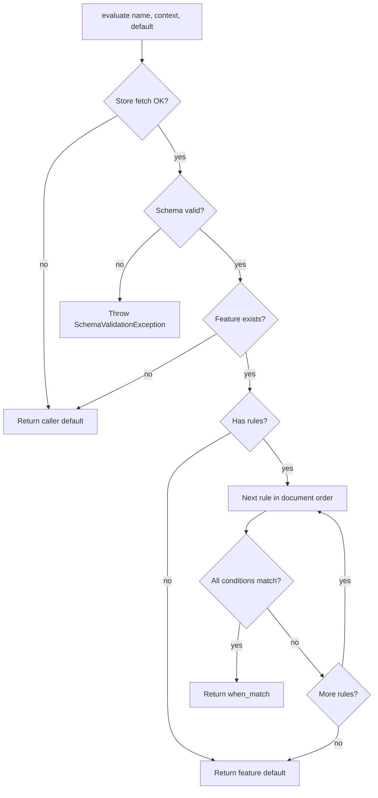

The feature flags utility provides a simple rule engine to decide when one or more features should be enabled
depending on the input context. The JSON schema is compatible with
[Powertools for AWS Lambda (Python)](https://docs.powertools.aws.dev/lambda/python/latest/utilities/feature_flags/){target="_blank"}.

!!! info
    When using `AppConfigStore`, only AppConfig
    [freeform configuration profiles](https://docs.aws.amazon.com/appconfig/latest/userguide/appconfig-creating-configuration-and-profile.html#appconfig-creating-configuration-and-profile-free-form-configurations){target="_blank"}
    are supported. Native AppConfig multi-variant feature flags are not supported.

## Key features

* Evaluate a single feature or list every feature that is enabled for a given context
* Static flags (`on` / `off`) and dynamic flags driven by rules
* Time-based and modulo-range conditions
* Non-boolean feature values (`boolean_type: false`)
* Fetch configuration from AWS AppConfig, or bring your own store
* No AspectJ configuration required
* GraalVM and SnapStart (CRaC) support

## Terminology

Feature flags change behaviour without changing application code. They can be **static** or **dynamic**.

**Static flags**. Something is simply `on` or `off`, for example `ten_percent_off_campaign`.

**Dynamic flags**. Something can have varying states, for example enable premium features for customer X but not Y.

???+ tip
    Use the [Parameters](./parameters.md) utility for static values fetched from SSM, Secrets Manager, DynamoDB, or
    AppConfig. This utility evaluates a rule document and can do both static and dynamic flags.

???+ warning
    Feature flags can increase application complexity over time. Use them sparingly.

## Getting started

### Installation

=== "Maven"

    ```xml hl_lines="3-7"
    <dependencies>
        ...
        <dependency>
            <groupId>software.amazon.lambda</groupId>
            <artifactId>powertools-feature-flags</artifactId>
            <version>{{ powertools.version }}</version>
        </dependency>
        ...
    </dependencies>
    ```

=== "Gradle"

    ```groovy hl_lines="6"
        repositories {
            mavenCentral()
        }

        dependencies {
            implementation 'software.amazon.lambda:powertools-feature-flags:{{ powertools.version }}'
        }

        sourceCompatibility = 11
        targetCompatibility = 11
    ```

This module does not use AspectJ. You do not need `aspectj-maven-plugin` or `aspectjrt` for feature flags.

### IAM Permissions

When using `AppConfigStore`, the function IAM role must allow:

| Action | IAM permission |
|--------|----------------|
| Fetch configuration | `appconfig:StartConfigurationSession`, `appconfig:GetLatestConfiguration` |

### Required resources

The following sample infrastructure is used throughout this page. The hosted configuration is a JSON document that
follows the [schema](#schema) below.

=== "template.yaml"

    ```yaml
    AWSTemplateFormatVersion: "2010-09-09"
    Resources:
      FeatureStoreApp:
        Type: AWS::AppConfig::Application
        Properties:
          Name: product-catalogue
      FeatureStoreDevEnv:
        Type: AWS::AppConfig::Environment
        Properties:
          ApplicationId: !Ref FeatureStoreApp
          Name: dev
      FeatureStoreConfigProfile:
        Type: AWS::AppConfig::ConfigurationProfile
        Properties:
          ApplicationId: !Ref FeatureStoreApp
          Name: features
          LocationUri: hosted
      HostedConfigVersion:
        Type: AWS::AppConfig::HostedConfigurationVersion
        Properties:
          ApplicationId: !Ref FeatureStoreApp
          ConfigurationProfileId: !Ref FeatureStoreConfigProfile
          ContentType: application/json
          Content: |
            {
              "premium_features": {
                "default": false,
                "rules": {
                  "customer tier equals premium": {
                    "when_match": true,
                    "conditions": [
                      { "action": "EQUALS", "key": "tier", "value": "premium" }
                    ]
                  }
                }
              },
              "ten_percent_off_campaign": {
                "default": true
              }
            }
      ConfigDeployment:
        Type: AWS::AppConfig::Deployment
        Properties:
          ApplicationId: !Ref FeatureStoreApp
          ConfigurationProfileId: !Ref FeatureStoreConfigProfile
          ConfigurationVersion: !Ref HostedConfigVersion
          DeploymentStrategyId: AppConfig.AllAtOnce
          EnvironmentId: !Ref FeatureStoreDevEnv
    ```

### Evaluating a single feature flag

Create a `FeatureFlags` instance with a store, then call `evaluate`.

The context is a `Map<String, Object>` of attributes that rules match against (for example `tier` or a
CloudFront viewer country). A missing feature, or a store failure, returns the caller-supplied default.

=== "App.java"

    ```java hl_lines="1-3 15-20 27"
    import software.amazon.lambda.powertools.featureflags.FeatureFlags;
    import software.amazon.lambda.powertools.featureflags.store.AppConfigStore;
    import software.amazon.lambda.powertools.featureflags.store.StoreProvider;

    public class App implements RequestHandler<Map<String, Object>, String> {

        private static final FeatureFlags FEATURE_FLAGS = FeatureFlags.builder()
                .withStore(AppConfigStore.builder()
                        .withApplication("product-catalogue")
                        .withEnvironment("dev")
                        .withName("features")
                        .build())
                .build();

        @Override
        public String handleRequest(Map<String, Object> input, Context context) {
            boolean premium = FEATURE_FLAGS.evaluate(
                    "premium_features",
                    input,
                    false);

            if (premium) {
                return "premium checkout";
            }
            return "standard checkout";
        }
    }
    ```

#### Static flags

A feature with only a `default` and no `rules` is a static flag. Evaluation returns that default.

=== "App.java"

    ```java hl_lines="3"
    boolean campaign = FEATURE_FLAGS.evaluate("ten_percent_off_campaign", false);
    ```

### Getting all enabled features

`getEnabledFeatures` returns the names of features that evaluate to a truthy value for the given context,
in document order.

=== "App.java"

    ```java hl_lines="3"
    List<String> enabled = FEATURE_FLAGS.getEnabledFeatures(input);
    // e.g. ["premium_features", "ten_percent_off_campaign"]
    ```

A feature is included when it is enabled by default with no rules, or when rule evaluation yields a truthy result
(Python-compatible truthiness: `null`, `false`, `0`, `""`, and empty lists/objects are false).

### Time based feature flags

Time conditions use the wall clock (UTC by default), not values from the evaluation context.

=== "schema"

    ```json
    {
      "support_chat": {
        "default": false,
        "rules": {
          "office_hours": {
            "when_match": true,
            "conditions": [
              {
                "action": "SCHEDULE_BETWEEN_TIME_RANGE",
                "key": "CURRENT_TIME",
                "value": { "START": "09:00", "END": "17:00", "TIMEZONE": "UTC" }
              }
            ]
          }
        }
      }
    }
    ```

Use `FeatureFlagsBuilder.withClock(Clock)` in tests to freeze time.

### Modulo range segmented experimentation

`MODULO_RANGE` buckets numeric context values, for example a percentage of users:

=== "schema"

    ```json
    {
      "ten_percent_experiment": {
        "default": false,
        "rules": {
          "bucket": {
            "when_match": true,
            "conditions": [
              {
                "action": "MODULO_RANGE",
                "key": "user_id",
                "value": { "BASE": 100, "START": 0, "END": 9 }
              }
            ]
          }
        }
      }
    }
    ```

`user_id % 100` in `[0, 9]` matches (inclusive). Non-numeric context values do not match.

### Beyond boolean feature flags

Set `"boolean_type": false` to return JSON objects, lists, or strings instead of coercing to `boolean`.

=== "schema"

    ```json
    {
      "checkout_config": {
        "default": { "group": "read-only" },
        "boolean_type": false,
        "rules": {
          "admin": {
            "when_match": { "group": "admin" },
            "conditions": [
              { "action": "EQUALS", "key": "role", "value": "admin" }
            ]
          }
        }
      }
    }
    ```

=== "App.java"

    ```java hl_lines="1-3"
    Map<String, Object> config = FEATURE_FLAGS.evaluate(
            "checkout_config",
            Map.of("role", "admin"),
            Map.of("group", "none"));
    ```

When `boolean_type` is omitted it defaults to `true`, and values are coerced with Python truthiness
(`1` → `true`, `0` → `false`).

## Advanced

### Adjusting in-memory cache

`AppConfigStore` delegates cache to the Parameters `AppConfigProvider` (default 5 seconds). Override with
`withMaxAge`:

=== "App.java"

    ```java hl_lines="6"
    AppConfigStore store = AppConfigStore.builder()
            .withApplication("product-catalogue")
            .withEnvironment("dev")
            .withName("features")
            .withMaxAge(10, ChronoUnit.MINUTES)
            .build();
    ```

You can also pass an existing `AppConfigProvider` with `withProvider(...)`, or a custom
`AppConfigDataClient` with `withClient(...)`.

### Getting fetched configuration

`getConfiguration()` returns the validated document. Schema errors throw
`SchemaValidationException`. Store errors throw `ConfigurationStoreException`.

=== "App.java"

    ```java
    Map<String, Object> document = FEATURE_FLAGS.getConfiguration();
    ```

`evaluate` and `getEnabledFeatures` catch `ConfigurationStoreException` and return the caller default or an
empty list. They do **not** swallow schema errors.

### Envelope

If the feature-flag object is nested inside a larger JSON document, unwrap it with a JMESPath expression:

=== "schema"

    ```json
    {
      "meta": { "version": 1 },
      "features": {
        "premium_features": { "default": false }
      }
    }
    ```

=== "App.java"

    ```java hl_lines="5"
    AppConfigStore store = AppConfigStore.builder()
            .withApplication("product-catalogue")
            .withEnvironment("dev")
            .withName("features")
            .withEnvelope("features")
            .build();
    ```

### Schema

The document is a JSON object whose keys are feature names.

#### Features

| Field | Required | Description |
|-------|----------|-------------|
| `default` | Yes | Value when no rule matches |
| `boolean_type` | No | `true` (default) coerces results to boolean; `false` returns the JSON value as-is |
| `rules` | No | Object of named rules, evaluated in document order |

#### Rules

| Field | Required | Description |
|-------|----------|-------------|
| `when_match` | Yes | Value returned when every condition matches |
| `conditions` | Yes | List of conditions; all must match (AND). An empty list never matches |

The first matching rule wins.

#### Conditions

| Field | Required | Description |
|-------|----------|-------------|
| `action` | Yes | Comparator name (see table below) |
| `key` | Yes | Context attribute to compare. Time actions still require a key (`CURRENT_TIME`) |
| `value` | Yes | Expected value, list, or range object |

| Action | Matches when |
|--------|----------------|
| `EQUALS` / `NOT_EQUALS` | Context equals / does not equal `value` |
| `KEY_GREATER_THAN_VALUE` | Context > `value` |
| `KEY_GREATER_THAN_OR_EQUAL_VALUE` | Context >= `value` |
| `KEY_LESS_THAN_VALUE` | Context < `value` |
| `KEY_LESS_THAN_OR_EQUAL_VALUE` | Context <= `value` |
| `STARTSWITH` / `ENDSWITH` | Context string starts / ends with `value` |
| `IN` / `KEY_IN_VALUE` | Context is contained in `value` (list, string, or map keys) |
| `NOT_IN` / `KEY_NOT_IN_VALUE` | Context is not contained in `value` |
| `VALUE_IN_KEY` / `VALUE_NOT_IN_KEY` | `value` is / is not contained in the context |
| `ANY_IN_VALUE` | Any item of the context list is in `value` |
| `ALL_IN_VALUE` | Every item of the context list is in `value` |
| `NONE_IN_VALUE` | No item of the context list is in `value` |
| `SCHEDULE_BETWEEN_TIME_RANGE` | Current time is between `value.START` and `value.END` (`HH:MM`, inclusive; overnight ranges supported) |
| `SCHEDULE_BETWEEN_DATETIME_RANGE` | Current time is between `value.START` and `value.END` (ISO-8601) |
| `SCHEDULE_BETWEEN_DAYS_OF_WEEK` | Current weekday is in `value.DAYS` (for example `["SATURDAY","SUNDAY"]`) |
| `MODULO_RANGE` | `context % value.BASE` is between `value.START` and `value.END` (inclusive) |

Time condition `value` objects accept optional `TIMEZONE` (IANA name, default `UTC`).

#### Rule engine flowchart



Comparison type errors (for example `STARTSWITH` on a number) do not throw; that condition fails to match.

### Create your own store provider

Implement `StoreProvider` and pass it to the builder. `getConfiguration()` must return a
`Map<String, Object>` (feature name → feature object) or throw `ConfigurationStoreException`.

=== "App.java"

    ```java
    public final class FileStore implements StoreProvider {
        private final Path path;

        public FileStore(Path path) {
            this.path = path;
        }

        @Override
        public Map<String, Object> getConfiguration() {
            try {
                return InMemoryStore.fromJson(Files.readString(path)).getConfiguration();
            } catch (IOException e) {
                throw new ConfigurationStoreException("Unable to read " + path, e);
            }
        }
    }

    FeatureFlags flags = FeatureFlags.builder()
            .withStore(new FileStore(Path.of("/tmp/features.json")))
            .build();
    ```

`InMemoryStore.fromJson(String)` and `InMemoryStore.fromMap(...)` are the built-in non-AWS stores.

## Testing your code

Inject `InMemoryStore` so tests do not call AppConfig:

=== "FeatureFlagsTest.java"

    ```java
    class FeatureFlagsTest {
        @Test
        void premiumTierEnablesFeature() {
            FeatureFlags flags = FeatureFlags.builder()
                    .withStore(InMemoryStore.fromJson("{"
                            + "\"premium_features\": {"
                            + "  \"default\": false,"
                            + "  \"rules\": {"
                            + "    \"tier\": {"
                            + "      \"when_match\": true,"
                            + "      \"conditions\": ["
                            + "        { \"action\": \"EQUALS\", \"key\": \"tier\", \"value\": \"premium\" }"
                            + "      ]"
                            + "    }"
                            + "  }"
                            + "}"
                            + "}"))
                    .build();

            assertThat(flags.evaluate("premium_features", Map.of("tier", "premium"), false)).isTrue();
            assertThat(flags.evaluate("premium_features", Map.of("tier", "standard"), false)).isFalse();
        }
    }
    ```

## Feature flags vs Parameters vs environment variables

| Need | Use |
|------|-----|
| Single static value, rarely changed | Environment variable |
| Encrypted secret, SSM parameter, or AppConfig blob | [Parameters](./parameters.md) |
| Rule-based, per-request decision from a JSON schema | Feature flags |

## Exceptions

| Exception | When |
|-----------|------|
| `SchemaValidationException` | Document does not match the schema (missing `default`, unknown `action`, …). Propagates from `evaluate`, `getEnabledFeatures`, and `getConfiguration`. |
| `ConfigurationStoreException` | Store cannot fetch or parse JSON. `evaluate` returns the caller default; `getEnabledFeatures` returns an empty list. |

## GraalVM and SnapStart

The module ships GraalVM reachability metadata and registers a CRaC hook that primes evaluation before a SnapStart
checkpoint. No extra configuration is required beyond depending on `powertools-feature-flags`.
